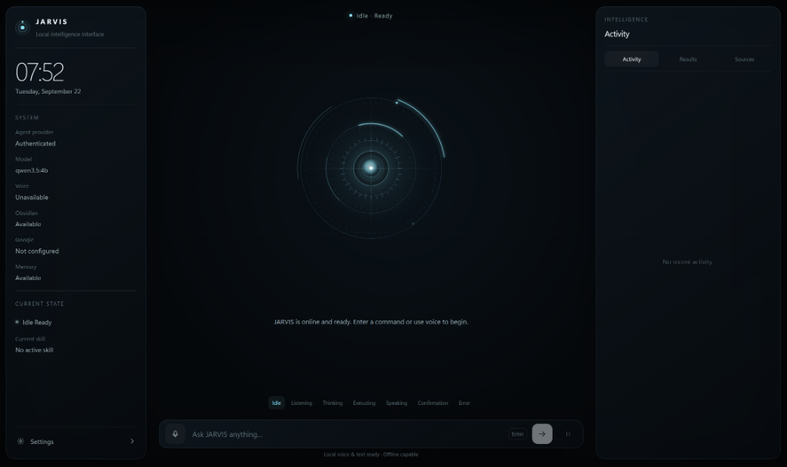

# JARVIS — Personal AI Operating Assistant

[](https://github.com/SamJU25/Jarvis-personal-assistant)
[](https://github.com/SamJU25/Jarvis-personal-assistant)
[](https://nextjs.org/)
[](https://react.dev/)
[](https://nodejs.org/)
[](Updated%20Prompts/JARVIS_Hermes_Antigravity_Prompt_Pack_v12)
[-orange.svg)](https://github.com/SamJU25/Jarvis-personal-assistant)
[](https://github.com/NousResearch/hermes-agent)

<p align="center">
  
</p>

<p align="center">
  <em>The live JARVIS Assistant Shell — showing the Holo JARVIS Core, real-time system vitals, offline model indicators, and reactive state machine. Transitioning to the large Holo Workspace with Memory Galaxy and Voice Wave in Phase 17.</em>
</p>

> *"Most AI assistants are glorified web chatbots living on someone else's server. They listen when they shouldn't, forget who you are between sessions, and demand subscription fees to summarize an email.*
>
> *JARVIS was built on a different principle: your assistant should live completely on your hardware, respect your privacy by default, store long-term memories in human-readable Markdown notes in your Obsidian vault, speak with zero-cloud neural voice, and feel like Tony Stark's command center."*

**JARVIS** is an open-source, local-first personal operating assistant and live control center. The master prompt architecture and cinematic UI concept were inspired by **Shab Noor | AI For Operators** ([watch on YouTube](https://youtu.be/s3WkutktHsw?si=j3zfBaRLci9tmWWe)), with local-first personal AI agent principles informed by **OpenJarvis** ([open-jarvis/OpenJarvis](https://github.com/open-jarvis/OpenJarvis)). Built on the **Nous Hermes 0.21.3** reasoning core, **Local Whisper STT**, **Kokoro-82M TTS**, and **Next.js 16 with Turbopack**, JARVIS replaces generic chat windows with an ambient command HUD, pinned tool security boundaries, explicit human confirmation for write actions, and 11 specialized child subagents.

---

## Architecture & System Topology

The system enforces strict boundaries between product experience, agent reasoning, inference routing, and system execution:

```
┌─────────────────────────────────────────────────────────────────────────────┐
│                       JARVIS Channels & UI Surface                          │
│     (Next.js App Router, Tailwind CSS, Framer Motion, SSE Event Client)     │
│   - Holo Workspace & Core               - Command Bar (Text + PTT Voice)   │
│   - System Rail & Live Mission Rail      - Reactive Control Center Settings │
└──────────────────────────────────────┬──────────────────────────────────────┘
                                       │
                User Request (Typed text or Local Voice STT)
                                       │
                                       ▼
┌─────────────────────────────────────────────────────────────────────────────┐
│                           JARVIS Agent Gateway                              │
│   - Session Continuity Mapping           - Deterministic Fast-Path (<10ms)  │
│   - Server-Side SSE Event Stream         - Request Lifecycle & Cancellation │
└──────────────────────────────────────┬──────────────────────────────────────┘
                                       │
                                       ▼
┌─────────────────────────────────────────────────────────────────────────────┐
│                             HERMES AGENT CORE                               │
│              (Runs / Sessions / Reasoning / Skills / Delegation)            │
│   - Native multi-step agent loop         - Pinned safe tool execution       │
│   - Context management & summarization   - 11 Specialist child delegations  │
└───────────────────────┬─────────────────────────────┬───────────────────────┘
                        │                             │
        Inference Path  ▼                             ▼  Capability Call
┌──────────────────────────────┐       ┌──────────────────────────────────────┐
│       FreeLLMAPI Gateway     │       │    JARVIS Governed Capability &      │
│  - model=auto routing        │       │           Policy Boundary            │
│  - Unified client auth       │       │  - 21 Application-Owned Tools        │
│  - Upstream provider balance │       │  - Strict Argument Coercion (Zod)    │
│  (Local Ollama Fallback)     │       │  - Dangerous Toolset Pinning Check   │
└──────────────────────────────┘       └──────────────────┬───────────────────┘
                                                          │
                                            Is Tool a Write Operation?
                                                   /              \
                                             [YES]                  [NO]
                                               /                      \
                                              ▼                        ▼
┌──────────────────────────────────────────────────┐   ┌──────────────────────────────┐
│             Human Confirmation Gate              │   │     Direct Tool Execution    │
│  - Cryptographic single-use token generation     │   │  - Obsidian Read / Search    │
│  - 60-second TTL replay attack rejection         │   │  - Gmail / Calendar / Drive  │
│  - Explicit dual approval (UI Card or Voice)     │   │  - Obsidian Memory Retrieval │
│  - Draft-only email creation (send forbidden)    │   │  - Governed Document Reading │
│  - Governed write_document preview               │   │  - Demo Tools & System Time  │
└─────────────────────────┬────────────────────────┘   └──────────────┬───────────────┘
                          │ Approved                                  │
                          ▼                                           │
┌──────────────────────────────────────────────────┐                  │
│             Execute Write Capability             │                  │
│  - create_note (Obsidian Vault Containment)      │                  │
│  - create_google_doc (Safe Google Workspace CLI) │                  │
│  - draft_email (Gmail Draft Only via GWS CLI)    │                  │
│  - write_document (Allowed Path Containment)     │                  │
│  - propose_skill_improvement (Controlled Learning)│                  │
└─────────────────────────┬────────────────────────┘                  │
                          │                                           │
                          └─────────────────────┬─────────────────────┘
                                                │
                                                ▼
┌─────────────────────────────────────────────────────────────────────────────┐
│                    Formal Verification Registry                             │
│   - Application-owned empirical post-execution verification                 │
│   - Deterministic disk containment, stat inspection, and ID validation      │
│   - 5-evidence document verification (path, existence, size, SHA-256)       │
│   - Model claims ("verified": true) strictly rejected as evidence           │
└───────────────────────────────────────┬─────────────────────────────────────┘
                                        │
                                        ▼
┌─────────────────────────────────────────────────────────────────────────────┐
│                      Diagnostic & Observability Engine                      │
│   - 11-stage lifecycle telemetry pipeline (Run -> ... -> Specialist -> ...) │
│   - Strict browser sanitization (redacting tokens, paths, audio, shell)     │
│   - performance.now() stage timing & latency profiling                      │
│   - Non-blocking local Kokoro TTS audio synthesis                           │
└─────────────────────────────────────────────────────────────────────────────┘
```

---

## Anatomy of the Cinematic Shell

The JARVIS interface shown above is engineered for ambient situational awareness rather than an endless scrolling message log. Every visual pixel corresponds to verified system state:

| Surface Area | Architectural Function | Real-Time Behaviors & Honest Safety Guarantees |
|---|---|---|
| **System Rail**<br>*(Left — ~220–240px)* | **Temporal Anchor & Health Telemetry** | Displays real-time digital clock, date, active reasoning provider status (`Authenticated`), active local model (`qwen3.5:4b`), and honest integration badges (`Obsidian: Available`, `Memory: Available`, `Voice: Unavailable`, `Google: Not configured`). Compact, useful, not a duplicate dashboard. No hardcoded "connected" illusions — if an integration is down, JARVIS honestly reports it. |
| **Holo Workspace**<br>*(Center — dominant)* | **Holo JARVIS Core + Memory Galaxy + Voice Wave** | Large functional holographic workspace containing the **Holo JARVIS Core** (functional hub with Memory/Skills/Agents/Activity domain entry points), surrounded by the **Memory Galaxy** (source-backed relationship graph), with the **Voice Wave** below. A reactive finite state machine dynamically animates across 9 distinct cognitive states: `Idle`, `Listening`, `Thinking`, `Working`, `Speaking`, `Approval`, `Completed`, `Error`, and `Disconnected`. Voice Wave reflects real audio capture/playback state. Governed by a strict 3-column no-overlap layout invariant — center wins the space budget. |
| **Command Bar**<br>*(Omni-Input Surface)* | **Unified Intent Seam** | Accepts natural-language text or local push-to-talk voice. High-speed regex accelerator bypasses LLM overhead (<10ms) for unambiguous queries like time checks. The status badge truthfully displays `Local voice & text ready · Offline capable`. |
| **Live Mission Rail**<br>*(Right — ~300–320px)* | **Semantic Result & Telemetry Feed** | Streaming workspace answering "What is JARVIS doing now?": **Activity** (real-time subagent SSE chips and execution logs), **Results** (typed semantic cards: Email Drafts, Meeting Prep, Notes, Documents, and the Specialist Team Tree), **Sources** (deduplicated provenance citations), **Agents/Delegation** status, and **Approval** state. Collapsible when center needs room. |

---

## Architecture History: Built From Scratch & Evolutionary Upgrades

JARVIS was engineered across two foundational eras:
1. **The Ground-Up Construction (Phases 1–12)**: How JARVIS was designed, architected, and built from an empty repository into a fully functioning, local-first operating assistant.
2. **The Modern Subagent & Intelligence Era (Phases 01–13 complete, then consolidated Phases 14A–23)**: How JARVIS migrated to the Nous Hermes multi-agent core, specialist child delegations, advanced memory retrieval, controlled learning, and file intelligence.

---

### Part 1: How JARVIS Was Built From Scratch (Foundational Phases 1–12)

| Milestone | Foundation Built From Scratch | Architectural Deliverables & Boundaries |
|---|---|---|
| **Phase 1** | **Cinematic Shell & State Machine** | Built the Next.js App Router shell with Tailwind CSS, Framer Motion, and a unified `JarvisShell` reducer. Created the CenterStage animated visualizer, live context rail, command bar, and sample activity stream. |
| **Phase 2** | **Provider Boundary & Headless Execution** | Designed the server-side provider boundary connecting JARVIS to Command Code headless execution with bounded role-aware conversations and NDJSON streaming. |
| **Phase 3** | **Generic Tool Registry & Capability Boundary** | Created the application-owned `ToolRegistry`, typed `JarvisTool` contracts with Zod validation, safe demo tools (`get_current_time`, `search_demo_data`), and turn-bounded tool loops. |
| **Phase 4** | **Obsidian Vault Integration** | Implemented server-only vault access (`search_vault`, `read_note`, `create_note`) with strict canonical path containment, read-only guarantees, and symlink traversal protection. |
| **Phase 5** | **Runtime Skill & Process Engine** | Created `SkillRegistry`, dynamic skill loader, and 5 foundational workflows (`morning-briefing`, `meeting-prep`, `capture-note`, `research`, `loose-ends`). |
| **Phase 6** | **Safe Google Workspace Integration** | Integrated server-side GWS CLI wrapper with safe process execution (`shell: false`), read tools (`search_gmail`, `get_calendar_events`, `search_drive`), and untrusted external content sanitization. |
| **Phase 7** | **Persistent Local Memory (SQLite)** | Built durable server-side memory using Node.js native `node:sqlite`, 4 memory tools (`search_memory`, `store_memory`, etc.), bounded retrieval, and secret credential rejection. |
| **Phase 7.5**| **Dual Reasoning Architecture (Local Ollama)** | Added local Ollama integration (`qwen3.5:4b`), runtime model discovery via `/api/tags`, JSON tool adapter, and seamless provider fallback without cloud dependencies. |
| **Phase 8** | **Fully Local Voice Subsystem** | Built zero-cloud local voice pipeline using offline `whisper.cpp` (STT) and neural `Kokoro-82M` (TTS) with ephemeral RAM-only audio and real-time barge-in. |
| **Phase 9** | **Human Confirmation Gate for Writes** | Established application-owned confirmation tracking with single-use cryptographic tokens (60s TTL) and drafts-only email creation (`draft_email`). Model cannot authorize writes. |
| **Phase 10**| **Deterministic Formal Verification** | Enforced that tool execution is NOT task completion. Created deterministic on-disk verification strategies (`note_verification`, `doc_verification`) that empirically verify file sizes, checksums, and containment. Model self-claims ("verified: true") are strictly rejected. |
| **Phase 11**| **Observability & Diagnostic Engine** | Expanded to an 11-stage telemetry pipeline, server-side `DiagnosticService` ring buffer, nanosecond latency timings, and full Debug Shell (`/debug`). |
| **Phase 12**| **Reliability & Multi-Turn Polish** | Added deterministic task fast-paths (<10ms for unambiguous queries), multi-turn card normalization (`formatAssistantTurn`), and non-blocking asynchronous audio synthesis. |

---

### Part 2: The Modern Evolutionary Upgrades & Prompt Pack v12.5 Roadmap

The modern evolutionary upgrades transitioned JARVIS to the Nous Hermes reasoning core, specialist child delegations, advanced memory retrieval, controlled learning, and file intelligence:

#### A. Completed Milestones (Phases 01–13)

| Phase | Milestone | Status | Key Deliverables & Verified Behavior |
|---|---|---|---|
| **Phase 01** | **Clean Shell & Boundary Separation** | **COMPLETED** | Cleaned legacy mock UI; established unified reactive shell state machine and responsive desktop/mobile layouts. |
| **Phase 02** | **Nous Hermes Core Integration** | **COMPLETED** | Connected server-side runtime directly to Nous Hermes Agent v0.21.3 API via Bearer auth, health probes, and session continuity. |
| **Phase 03** | **Pinned Dangerous Toolsets** | **COMPLETED** | Pinned dangerous toolsets (`terminal`, `code_execution`, unrestricted fs); enforced 17 typed application-owned tools. |
| **Phase 04** | **Hermes Core Reasoning Loop** | **COMPLETED** | Hermes became authoritative multi-step agent core owning the reasoning loop and SSE event stream via `/v1/runs`. |
| **Phase 05** | **FreeLLMAPI & Functional Settings** | **COMPLETED** | Connected FreeLLMAPI gateway for intelligent upstream routing (`model=auto`) and functional key management with write-only inputs. |
| **Phase 06** | **Capability Registry & Trace Correlation** | **COMPLETED** | Unified tools into Capability Registry with idempotent execution tracking and correlation IDs. |
| **Phase 07** | **Intent & Alias Registry** | **COMPLETED** | High-speed regex accelerator and safety-sensitive intent router bypassing redundant LLM reasoning. |
| **Phase 08** | **Specialist Agent Orchestration** | **COMPLETED** | Implemented Hermes child delegation via `delegate_task` (`delegation` toolset). Established 11 domain specialists, child permission containment, and specialist tree card synthesis. |
| **Phase 09** | **Google Workspace Consolidation** | **COMPLETED** | Exhaustive parity check between JARVIS and Hermes Google capabilities; preserved all 7 application-owned GWS tools under strict application control. |
| **Phase 10** | **Web Research + Grounded Provenance** | **COMPLETED** | Governed provenance around Hermes's native `web` toolset; URL scheme verification, text sanitization, and deduplicated source citations. |
| **Phase 11** | **Advanced Obsidian Memory Retrieval** | **COMPLETED** | Scored retrieval index over canonical Markdown notes (`AI/Memory/`) with mtime change detection and signal tracing. |
| **Phase 12** | **Obsidian Skills + Controlled Learning** | **COMPLETED** | Human-gated skill improvement via `propose_skill_improvement`, deterministic unified diff previews, and vault skill versioning (`AI/Skills/`). |
| **Phase 13** | **File + Document Intelligence** | **COMPLETED** | Governed file operations across explicit allowed roots (`documents`, `vault`). Traversal-safe containment, safe binary metadata extraction, 21 registered tools (`list_documents`, `read_document`, `write_document`), and 5-evidence deterministic `document_verification`. |

---

#### B. Active Roadmap: Prompt Pack v12.5 (Phases 14A–23)

In **Prompt Pack v12.5**, the roadmap was restructured around a strict **Hermes-First Consolidation Model**: rather than building duplicate engines in JARVIS, capabilities native to the installed Hermes runtime are audited, verified, migrated, and retired from duplicate production paths.

| Phase | Milestone | Status | Key Deliverables & Architectural Focus |
|---|---|---|---|
| **Phase 14A** | **Hermes Runtime Alignment + Binding Verification** | **ACTIVE NEXT** | Establish factual current Hermes/JARVIS runtime boundary; verify existing `127.0.0.1:8642` endpoint and inspect against `hermes serve` (port `9119`); prove live health, session continuity, and safe error handling without creating duplicate runtimes; document actual interface in `docs/HERMES-RUNTIME.md`. |
| **Phase 14** | **Hermes Capability Ownership Audit** | QUEUED | Formulate comprehensive capability parity matrix (inference, local models, voice, memory, skills, delegation, Google Workspace); identify native vs duplicate paths; contract updates before code removal. |
| **Phase 15** | **Duplicate Retirement & Hermes-Native Consolidation** | QUEUED | Migrate execution to native Hermes capabilities verified in Phase 14; explicitly retire duplicate JARVIS production inference/voice/skills paths while preserving safety policies and UI state contracts. Duplicate retirement is the explicit outcome of this phase. |
| **Phase 16** | **Unified JARVIS Control Plane + Live Hermes Synchronization** | QUEUED | Single control surface over Hermes configuration/status; Zod snapshot (`/api/settings/snapshot`) + SSE stream (`/api/settings/events`); live server-side external state synchronization; dynamic reconciliation of external Hermes changes without page reload. |
| **Phase 17** | **Large Holo Core + Memory Galaxy + Voice Wave + Rail Refinement** | QUEUED | Replace decorative reactor with large functional **Holo Workspace**: **Holo JARVIS Core** (functional hub with Memory/Skills/Agents/Activity domains), surrounding **Memory Galaxy** (source-backed graph), audio-reactive **Voice Wave**, renamed **System Rail** (left, ~220–240px) and **Live Mission Rail** (right, ~300–320px); enforce strict 3-column no-overlap layout with center visual dominance. |
| **Phase 18** | **Canonical Memory/Obsidian Workspace** | QUEUED | Normalized graph query bridging `Jarvis Memory` Obsidian vault notes with Hermes agent runtime memory facts; interactive node inspection; strict vault ownership rules enforced. |
| **Phase 19** | **Hermes Agents/Bots + Skills Workspace** | QUEUED | Expose real Hermes Bot Mode profiles, delegated specialists, and skills in JARVIS UI without creating parallel child process managers. |
| **Phase 20** | **Hermes Channels + Cron/Proactive Workspace** | QUEUED | Unified control surface for Hermes-supported channels (Telegram, etc.) and cron/scheduled tasks; safe credential isolation. |
| **Phase 21** | **Plugins/Capabilities/Security/Diagnostics** | QUEUED | Real Hermes plugin/provider discovery; normalized capability manifest; security permission auditing and execution trace monitors. |
| **Phase 22** | **UX/Accessibility/Responsive/Performance** | QUEUED | Layout container queries, mobile sheet drawers, accessible list fallbacks for the Memory Galaxy, reduced-motion support, `prefers-reduced-motion` respect, and latency optimization. |
| **Phase 23** | **Final Preflight & Regression** | QUEUED | End-to-end invariant validation: prove JARVIS is a unified control plane over Hermes with zero unverified duplicate production engines; no-duplicate invariants and live external-change tests. |

---

### In-Depth: Prompt Instruction Evolution (Pack v11 → v12.2 → v12.5)

The prompt instruction pack located under [`Updated Prompts/`](Updated%20Prompts/) underwent a fundamental architectural evolution from **v11** through **v12.2** to **v12.5**:

```
Prompt Pack v11 (Legacy 25-Phase Roadmap)
  - Broad roadmap covering 25 independent phases (P01–P25)
  - JARVIS independently implementing voice engines, schedulers, browser automations, computer control
  - Standalone FreeLLMAPI gateway managed directly by JARVIS
  - Decorative CenterStage Mark-LIV reactor

                        ▼ Architectural Tightening (v12.2)

Prompt Pack v12.2 (Hermes-First Architecture & UI v2)
  - Starting point reset: Starts from Phase 13 complete (archived P01–P13)
  - Strict Non-Duplication Rule: Audit Hermes native parity first; retire duplicate JARVIS production paths
  - Hermes Serve Integration Boundary: Headless JSON-RPC/WebSocket service (port 9119) server-to-server
  - Canonical Obsidian Vault: Hard constraint that `Jarvis Memory` is the vault root (OBSIDIAN_VAULT_PATH)
  - Dynamic UI Synchronization (Rule 7A): Real-time reconciliation of external Hermes changes without page reload
  - Cinematic UI v2: Memory Galaxy + Holo JARVIS Core + Audio-Reactive Voice Wave (strict 3-column layout)
  - Streamlined 10-phase execution plan (Phases 14A through 23)

                        ▼ v12.5 Corrections & Refinements

Prompt Pack v12.5 (Verified Binding & Large Holo Workspace)
  - Phase 14A reframed as runtime alignment/binding verification, not unconditional installation
  - Explicit port ambiguity handling: 127.0.0.1:8642 (repo) vs 9119 (Hermes docs) — inspect, don't assume
  - Truth hierarchy: live code/runtime > installed Hermes > contracts/tests > docs > old roadmap
  - Duplicate retirement made an explicit Phase 15 outcome
  - Strict `Jarvis Memory` vault-root ownership rules (AI/Memory and AI/Skills are subfolders, not vaults)
  - Large Holo Workspace specification: functional holographic hub, not decorative reactor
  - Holo Core functional domains: Memory, Skills, Agents/Bots, Activity
  - Rails renamed: System Rail (left, ~220–240px) and Live Mission Rail (right, ~300–320px)
  - Real-state Voice Wave rules (waveform must never imply audio when none is active)
  - Dynamic external-Hermes-change synchronization requirements
  - Added VERIFIED_REPO_STATE.md, VERIFIED_REFERENCES.md, and completion/continue templates
```

#### Key Instruction Changes (v12.2 → v12.5):
1. **Starting Point Reset (Phase 13 Complete)**:
   - **v11** carried prompts starting from initial scaffolding (`PHASE_01.md` through `PHASE_25.md`).
   - **v12.5** recognizes that Phases 01–13 are already implemented, tested (612 passing tests), and verified in this codebase. All completed legacy phases were archived, and execution picks up directly at `PHASE_14A.md`.
2. **Strict Non-Duplication Principle**:
   - **v11** planned bespoke JARVIS implementations for voice pipelines v2, scheduling daemons, browser automation, and computer control.
   - **v12.5** mandates that if the installed Hermes build natively supports a capability (voice, model routing, skills, Bot delegation, cron, channels, plugins), JARVIS must **not duplicate it**. Instead, JARVIS acts as the product shell, policy governor, confirmation gate, and verification authority over Hermes's execution engine.
3. **Runtime Alignment, Not Blind Installation (v12.5 correction)**:
   - Phase 14A was reframed from "Hermes Bootstrap" to **"Runtime Alignment + Binding Verification"**. The repository already documents Hermes integration, so Phase 14A first proves what actually exists before changing anything.
   - The JARVIS repository documents a Hermes API server at `127.0.0.1:8642`, while official Hermes CLI docs document `hermes serve` on port `9119`. v12.5 deliberately does NOT assert that one should replace the other without inspection.
   - **Truth hierarchy** when sources disagree: (1) Actual local code and live runtime behavior → (2) Installed Hermes version and supported interfaces → (3) Current JARVIS contracts/tests → (4) Current documentation → (5) Old roadmap prose.
4. **Canonical Vault Rule (`Jarvis Memory`)**:
   - The user's actual directory **`Jarvis Memory`** is enforced as the immutable canonical Obsidian vault root (`OBSIDIAN_VAULT_PATH`).
   - `AI/Memory/` is a subfolder inside the vault, not another vault. `AI/Skills/` is a subfolder inside the vault, not another vault.
   - Coding agents are forbidden from inventing a second vault, creating a second canonical SQLite memory store for the same durable facts, or making Hermes `HERMES_HOME` the JARVIS Obsidian vault.
   - Memory Galaxy is explicitly defined as a **derived visualization/index metadata layer**, never a separate database.
5. **Live External State Synchronization**:
   - If a user changes a model, voice setting, skill, or bot profile outside JARVIS (e.g. via Hermes CLI or Hermes dashboard), JARVIS automatically observes and reconciles the change without requiring a full browser page refresh.
   - Preferred reconciliation order: Hermes WebSocket stream → status readback → bounded server polling with backoff.
   - Every normalized snapshot must have a timestamp/version/source where practical to distinguish stale from fresh data.
6. **Large Holo Workspace Visual Direction ([`UI_GUIDE.md`](Updated%20Prompts/JARVIS_Hermes_Antigravity_Prompt_Pack_v12/UI_GUIDE.md))**:
   - The old large decorative reactor is replaced with a **large functional holographic workspace**:
     - **Holo JARVIS Core**: Functional holographic hub (not just an animation) at the center, exposing entry points for Memory, Skills, Agents/Bots, and Activity, reflecting 9 real runtime states (`idle`, `listening`, `thinking`, `working`, `speaking`, `approval`, `completed`, `error`, `disconnected`).
     - **Memory Galaxy**: Surrounding context visualization of real relationships between `Jarvis Memory` Markdown notes and Hermes runtime facts, with deterministic source-backed edges.
     - **Voice Wave**: Real-state center visualizer — waveform must never imply audio activity when no audio is playing/being captured.
     - **System Rail** (left, ~220–240px): Compact status, health, navigation. Not a duplicate dashboard.
     - **Live Mission Rail** (right, ~300–320px): Activity, results, sources, agents, approvals.
     - **Strict Layout Invariant ("NO OVERLAP")**: Three-column bounded grid; center wins the space budget; collapse rails before shrinking Holo.
7. **`ANTIGRAVITY_MASTER_PROMPT.md`**:
   - v12.5 includes [`ANTIGRAVITY_MASTER_PROMPT.md`](Updated%20Prompts/JARVIS_Hermes_Antigravity_Prompt_Pack_v12/ANTIGRAVITY_MASTER_PROMPT.md) as a single, comprehensive context prompt for autonomous IDE coding agents.
8. **Verified References & Repo State (v12.5 additions)**:
   - [`VERIFIED_REPO_STATE.md`](Updated%20Prompts/JARVIS_Hermes_Antigravity_Prompt_Pack_v12/VERIFIED_REPO_STATE.md): Records what was actually visible in the public repository and current Hermes documentation when the pack was generated.
   - [`VERIFIED_REFERENCES.md`](Updated%20Prompts/JARVIS_Hermes_Antigravity_Prompt_Pack_v12/VERIFIED_REFERENCES.md): Cites all verified JARVIS and Hermes official sources used by the pack.
   - [`COMPLETION_REPORT_TEMPLATE.md`](Updated%20Prompts/JARVIS_Hermes_Antigravity_Prompt_Pack_v12/COMPLETION_REPORT_TEMPLATE.md) and [`CONTINUE_TEMPLATE.md`](Updated%20Prompts/JARVIS_Hermes_Antigravity_Prompt_Pack_v12/CONTINUE_TEMPLATE.md): Standardized templates for phase completion reporting and session continuation.

---

## Core Capabilities & Subsystems

### 1. Dual-Reasoning Engine with Hermes & Ollama
- **Primary Agent Core**: Nous Hermes Agent (`0.21.3`) operating as a local server agent (`http://127.0.0.1:8642`) with native support for multi-step runs, tool calling, and session continuity.
- **Local Fallback**: Ollama (`qwen3.5:4b`) running with native JSON schema enforcement, `think: false`, and `keep_alive: 15m` for ultra-fast fallback responses.
- **Deterministic Fast-Path**: Direct regex-accelerated resolver for unambiguous system queries (e.g. system time) executing in `<10ms` without provider roundtrips.

### 2. Fully Local Voice Pipeline (Whisper + Kokoro)
- **Speech-to-Text (STT)**: Offline `whisper.cpp` running locally on port 8080.
- **Text-to-Speech (TTS)**: Offline `Kokoro-82M` ONNX neural speech synthesizer running locally on port 8880.
- **Privacy Guarantee**: Audio buffers exist only ephemerally in RAM during active transcription/synthesis. Zero audio is stored to disk or uploaded to any third-party cloud.
- **Barge-in Support**: Speaking or pressing the stop button instantly interrupts active speech playback.

### 3. Pinned Tool Security & Governed Capability Boundary
- **21 Application-Owned Tools**:
  - *Obsidian Vault*: `search_vault`, `read_note`, `create_note`.
  - *Governed Documents & Files*: `list_documents`, `read_document`, `write_document` (contained to allowed roots `documents`, `vault`).
  - *Google Workspace*: `search_gmail`, `read_gmail`, `get_calendar_events`, `search_drive`, `read_drive_file`, `create_google_doc`, `draft_email`.
  - *Persistent SQLite Memory*: `search_memory`, `store_memory`, `list_memory`, `delete_memory`.
  - *System & Demo*: `get_current_time`, `search_demo_data`, `read_demo_item`.
- **Read/Write Partitioning**: Read operations execute autonomously; write operations (`create_note`, `create_google_doc`, `draft_email`, `write_document`, `propose_skill_improvement`) are intercepted before execution.
- **Drafts Only**: Email actions are strictly limited to `draft_email`. Sending emails is prevented by design.
- **Pinned Toolsets**: Hermes API server is verified on launch to ensure dangerous capabilities (`terminal`, `code_execution`, `raw_file_write`) are disabled.

### 4. Human Confirmation & Deterministic Verification
- **Single-Use Tokens**: Every write proposal generates a cryptographic token with a 60-second TTL. Replays and duplicate consumptions are blocked.
- **Dual Approval Channels**: Confirmations can be approved via UI Confirmation Cards or spoken voice intent ("yes, proceed", "confirm").
- **Deterministic Post-Execution Verification**: Model claims ("verified: true") are strictly ignored. Writes are verified by empirical application logic:
  - Notes: File existence and size checked on disk within canonical vault path.
  - Documents: 5-evidence verification (execution, root containment, on-disk existence, file size, SHA-256 hash match).
  - Google Docs: Valid document ID and URL verified from GWS CLI output.
  - Emails: Confirmed as a draft in Gmail.

### 5. Modular Subagent Architecture (11 Dedicated Specialists)
To eliminate prompt bloat and prevent context overload on the main orchestrator, JARVIS delegates domain-specific work across **11 focused Hermes Specialist Subagents**:
- **`frontend`**: Frontend & UI/UX (React, Next.js App Router, Tailwind, Remotion, UI/UX Pro Max).
- **`backend`**: Backend & Systems (REST/GraphQL APIs, Auth patterns, PostgreSQL/SQLite, Go, Kotlin, TypeScript).
- **`quality`**: Testing, Debugging & QA (Systematic debugging, TDD, profiling, Web Vitals, Security audits).
- **`architecture`**: Architecture & Planning (Socratic brainstorming, Excalidraw diagrams, Graphify, Vercel deployments).
- **`academic`**: Academic & Assignment Suite (Thesis structuring, literature reviews, CS lab reports, IEEE/APA citations, rubric auditing).
- **`marketing`**: Product Launch & Growth (Product Hunt/Show HN playbooks, copywriting, social media distribution, technical SEO).
- **`research`**: Deep vault and document retrieval, Google Drive search, knowledge synthesis.
- **`coding`**: General code inspection and refactoring.
- **`productivity`**: Calendar, daily briefings, agenda planning, loose ends.
- **`memory`**: Persistent SQLite memories and Obsidian vault lookup.
- **`communications`**: Gmail correspondence and email drafting.

### 6. In-Depth: How Obsidian Stores Memory and Skills

JARVIS avoids opaque, cloud-locked, or proprietary databases for your personal intelligence. Instead, your local Obsidian vault (`Jarvis Memory`) serves as the **canonical, human-readable, single source of truth**. The vault root is always the directory named `Jarvis Memory` — `AI/Memory/` and `AI/Skills/` are subfolders inside it, never separate vaults. You can open Obsidian at any time, browse your memories, edit your skills in plain Markdown, or sync them with your mobile devices via Obsidian Sync or Git without any proprietary barriers.

```
F:\Jarvis\Jarvis Memory\
├── AI/                          <-- Dedicated, strictly contained JARVIS boundary
│   ├── Memory/                  <-- Canonical Long-Term Memories (*.md)
│   │   ├── mem-user-tech-stack.md
│   │   ├── mem-project-roadmap.md
│   │   └── mem-personal-preferences.md
│   ├── Skills/                  <-- Canonical Runtime Skills (<name>/SKILL.md)
│   │   ├── academic-writer/
│   │   │   ├── SKILL.md
│   │   │   └── .history/        <-- Version rollback backups
│   │   ├── frontend-developer/
│   │   │   └── SKILL.md
│   │   ├── marketing-specialist/
│   │   │   └── SKILL.md
│   │   └── ... (22 skills)
│   └── README.md
└── (All your personal notes)    <-- Pristine; untouched by JARVIS
```

#### A. Durable Memory Format (`AI/Memory/`)
Every memory is saved as an individual Markdown note with structured, typed YAML frontmatter:
```markdown
---
id: "mem-e8f2a1b9"
title: "User Programming Stack & Career Goals"
category: "preference"
tags: ["typescript", "nextjs", "python", "ai-engineer"]
createdAt: "2026-09-20T14:32:00Z"
updatedAt: "2026-09-22T07:15:00Z"
---
The user is an engineering student focused on becoming a Web Developer and AI Engineer.
Prefers Next.js App Router, TypeScript, Tailwind CSS, and rigorous test coverage.
```

* **Lightweight `mtime` Change Detection (`src/lib/obsidian/memory-index.ts`)**:
  - JARVIS does not run heavy, battery-draining background daemon file watchers.
  - Instead, it maintains a disposable, derived in-memory index.
  - On every user query, JARVIS checks the filesystem `mtime` (modified timestamp) of `AI/Memory/` and individual note files using native Node.js `fs.stat`.
  - If you add, edit, or delete notes in Obsidian desktop or mobile, JARVIS detects the `mtime` drift instantly on the next turn and re-indexes only the modified files in `<2ms`.
* **Multi-Tier Scored Retrieval & Signal Tracing**:
  - Retrieval uses a deterministic, keyword-first scoring engine:
    - **Title Matches**: `weight: 3.0` (strongest intentional anchor).
    - **Tag Matches**: `weight: 2.5` (domain categorization).
    - **Category Matches**: `weight: 1.5` (workflow affinity).
    - **Body Content Overlap**: `weight: 1.0` (semantic context).
  - Every retrieved memory includes a full **Signal Trace** (e.g. `matched_terms: ["typescript", "ai-engineer"], score: 7.0, source: "AI/Memory/mem-user-tech-stack.md"`). This trace is visible in the 11-stage Debug Shell (`/debug`) under the `MEMORY` stage, providing 100% transparent auditability into why an AI response was informed by a memory.
* **Bounded Context Retrieval**:
  - To prevent prompt bloat, memory retrieval is strictly bounded (top-5 notes by default, capped at 10). Notes are formatted into clean XML context tags for the LLM.
* **Proactive Secret Filtering (`containsSecret()`)**:
  - Before writing any note to disk via `store_memory` or `create_note`, the content is scanned against high-entropy regex patterns (OpenAI `sk-...`, GitHub `ghp_...`, Bearer tokens, private keys, passwords). If a secret is detected, storage is rejected immediately to protect your vault from credential leaks.

#### B. Runtime Skill Discovery & Controlled Learning (`AI/Skills/`)
* **Dynamic Skill Loading (`src/lib/obsidian/skills.ts`)**:
  - On startup or on-demand refresh, `discoverObsidianSkills()` traverses `AI/Skills/*/SKILL.md`.
  - It parses frontmatter (`name`, `description`, `tags`, `category`, `tools`) and validates it against the Zod `SkillDefinition` contract.
  - Skills are hot-loaded into the runtime `SkillRegistry` without restarting the application.
* **Semantic & Intent-Driven Selection (`selectSkill()`)**:
  - When you prompt JARVIS (e.g. "Draft an IEEE literature review" or "Prepare my morning briefing"), the system evaluates user intent against skill descriptions and loads the specialized instructions into the active context.
* **Human-Gated Controlled Learning (`src/lib/learning/`)**:
  - JARVIS learns from corrections and user instructions, but **cannot autonomously self-modify its own instructions**.
  - When an improvement is suggested via `propose_skill_improvement`, JARVIS computes a deterministic unified diff.
  - The UI renders a **Human Confirmation Preview Card** displaying the exact line-by-line diff (green additions `+`, red deletions `-`).
  - The previous version is backed up in `.history/<skill>-<timestamp>.md` before disk write. If a change is undesirable, you can roll it back instantly.

---

### 7. In-Depth: How Hermes Sub-Agents Handle Work for JARVIS

To prevent the main orchestrator from slowing down under heavy prompts, bloated contexts, or complex tool runs, JARVIS implements an asynchronous hierarchical architecture: **Top-Level Orchestrator** vs **Leaf Specialist Subagents**.

```
                  1. User Request ("Build Next.js component & test it")
                                     │
                                     ▼
                    ┌──────────────────────────────────┐
                    │       JARVIS / HERMES CORE       │
                    │      (Top-Level Conductor)       │
                    └────────────────┬─────────────────┘
                                     │
                        2. Evaluates Delegation Policy
                        3. Calls native `delegate_task`
                                     │
                 ┌───────────────────┴───────────────────┐
                 ▼                                       ▼
    ┌───────────────────────────┐           ┌───────────────────────────┐
    │     Child Subagent A      │           │     Child Subagent B      │
    │  (Frontend Specialist)    │           │    (Quality Specialist)   │
    │                           │           │                           │
    │ - Fresh, isolated context │           │ - Fresh, isolated context │
    │ - Loads only UI skills    │           │ - Loads only TDD skills   │
    │ - Executes UI tools       │           │ - Runs tests / vitest     │
    └────────────┬──────────────┘           └────────────┬──────────────┘
                 │                                       │
                 └───────────────────┬───────────────────┘
                                     │ 4. Subagent SSE Events:
                                     │    subagent.start / subagent.complete
                                     ▼
                    ┌──────────────────────────────────┐
                    │      JARVIS Stream Handler       │
                    │   - Synthesizes Specialist Tree  │
                    │   - Enforces Permission Bounds   │
                    │   - Strips 90% Raw Verbose Logs  │
                    └────────────────┬─────────────────┘
                                     │
                                     ▼
                    ┌──────────────────────────────────┐
                    │        FINAL RESULT CARD         │
                    │     "Task completed cleanly"     │
                    │   ├─ Frontend Specialist     ✓   │
                    │   ├─ Quality Specialist      ✓   │
                    │   └─ Synthesis               ✓   │
                    └──────────────────────────────────┘
```

#### A. Orchestrator vs. Leaf Subagent Roles
- **JARVIS Orchestrator**: The top-level conductor that interfaces with the user, evaluates intent, decides whether to execute directly or delegate, and synthesizes the final conversational response.
- **Hermes Leaf Specialists**: Task-focused child agents spawned via Hermes's native `delegate_task` in the `delegation` toolset. Each specialist is assigned a scoped subtask, a designated role persona, and a subset of permitted tools.

#### B. The Load Question: "Can I Add As Many Subagents As I Want?"
A common architectural concern is whether adding many subagents will create severe system lag or GPU overload:
1. **Registered Specialist Definitions (Zero Overhead)**:
   - You can define **dozens or hundreds** of specialist personas and skills in the registry.
   - When idle, registered specialist definitions are simple static JSON/Markdown files that consume **zero CPU, GPU, or RAM**.
2. **Runtime Concurrency & Depth Bounds (Strictly Guarded)**:
   - During live execution, JARVIS prevents resource starvation and infinite agent loops through hard architectural limits (`src/lib/specialist/policy.ts`):
     - `MAX_DEPTH = 1`: Subagents are strictly leaf nodes. A child subagent can **never** spawn sub-subagents.
     - `concurrencyLimit = 2`: At most 2 child subagents can execute concurrently.
     - `maxExecutionTimeMs = 60000`: Hard 60-second timeout per subagent execution.
   - This ensures your local machine runs smoothly regardless of how many specialized roles exist in your library.

#### C. Fresh Context Window & 90% Token Savings
- **The Problem with Single-Agent Monoliths**: If a single agent attempts a multi-step task (e.g. running tests, inspecting 10 files, generating code, reviewing style), intermediate tool logs and stack traces flood the context window, quickly consuming 30k–60k tokens. This causes extreme response latency, high RAM usage, and reasoning degradation.
- **The Subagent Isolation Solution**:
  - Each Hermes child subagent starts with a **100% fresh, isolated conversation session**.
  - It receives only its targeted goal and required context.
  - The subagent performs its tools and reasoning in isolation.
  - When finished, the subagent returns a concise summary of its findings or created artifacts.
  - Over 90% of raw terminal outputs, intermediate drafts, and verbose logs are absorbed inside the child session, leaving the parent orchestrator fast, responsive, and sharp.

#### D. The 11 Pre-Configured Specialist Subagents
JARVIS includes 11 specialized personas configured with optimal tools and system instructions:
- **`academic`**: Thesis structuring, assignment literature reviews, CS lab reports, IEEE/APA citation formatting, grading rubric alignment.
- **`marketing`**: Product launch copywriting, Product Hunt & Show HN distribution, social announcement strategy, technical SEO.
- **`frontend`**: React 19, Next.js App Router, Tailwind CSS, Framer Motion, Remotion visual design, UI/UX Pro Max standards.
- **`backend`**: Node.js/Express, REST/GraphQL design, Go concurrency, Kotlin multiplatform, SQLite/PostgreSQL architecture.
- **`quality`**: Test-driven development (TDD), Vitest suite execution, systematic debugging, OWASP security reviews, Web Vitals auditing.
- **`architecture`**: High-level system design, Socratic brainstorming, Excalidraw visual maps, Graphify knowledge networks, Vercel deployments.
- **`research`**: Multi-source vault retrieval, Google Drive search, web provenance aggregation, synthetic summaries.
- **`coding`**: General code refactoring, TypeScript type puzzles, lint resolution, modular file organization.
- **`productivity`**: Google Calendar scheduling, morning briefings, meeting prep, daily agenda prioritization, loose-ends tracking.
- **`memory`**: Long-term SQLite retrieval, Obsidian memory note synthesis, knowledge base querying.
- **`communications`**: Gmail inbox search, correspondence drafting (`draft_email` only; sending strictly blocked).

#### E. The Human Confirmation Safety Gate for Subagents
- **Subagents Inherit Parent Boundaries**: Child agents have no elevated privileges.
- **Write Interception**: If any child subagent initiates a write action (`write_document`, `create_note`, `draft_email`, `create_google_doc`), the action is immediately trapped by JARVIS's application-owned `ConfirmationService`.
- A single-use cryptographic token (60-second TTL) is generated and rendered as a **Confirmation Card** in the browser. The subagent halts until the human explicitly clicks **Approve** or speaks approval.

#### F. Real-Time Telemetry & Specialist Tree Card
- As subagents execute via the Hermes runtime, SSE telemetry events (`subagent.start`, `subagent.complete`) stream to the browser in real time.
- The CenterStage UI displays live animated chips indicating which specialist is currently active.
- Upon completion, JARVIS synthesizes a structured **Specialist Team Card** showing:
  - Each participating specialist's name and role icon.
  - Exact execution duration in milliseconds.
  - Number of tools executed by each subagent.
  - Final deterministic completion status (`✓`).

---

## Verification & Quality Gates

JARVIS enforces strict quality gates on every commit. The codebase maintains 100% test coverage for core paths:

```powershell
# Run the full unit and integration test suite (100 files, 612 tests)
npm test

# Run code style & linting checks (ESLint 9)
npm run lint

# Run strict TypeScript compiler checks
npm run typecheck

# Build the production Turbopack bundle
npm run build
```

### Live Runtime Verification Suite

To verify the live backend against the running Hermes API server, local voice engines, and disk storage:

```powershell
# Verify live Hermes client health, capabilities, and auth rejection
npx tsx scripts/verify-hermes-live.ts

# Verify end-to-end multi-step tool execution, confirmation, and on-disk verification
npx tsx scripts/verify-phase3-live.ts
```

*Verification Results (Verified 2026-09-22):*
- `[Check 0]`: Hermes toolsets pinned (`web`, `session_search`, `clarify` active; `terminal` & `execute` disabled).
- `[Test 1]`: Conversational greeting answered successfully.
- `[Test 2]`: Multi-turn context and memory continuity preserved.
- `[Test 3]`: Read tool (`get_current_time`) executed and formatted.
- `[Test 4]`: Request cancellation via `AbortSignal` safely handled.
- `[Test 5]`: Provider configuration failure gracefully caught.
- `[Test 6]`: Write tool proposal intercepted by human confirmation gate.
- `[Test 7]`: Post-write note created and verified on disk within vault containment.

---

## Getting Started

### 1. Prerequisites
- **Node.js**: `v24.19.0+`
- **Python**: `3.10+` (for Hermes API Server and local Kokoro/Whisper voice runtime)
- **Ollama**: Download from [ollama.com](https://ollama.com). Runs open-weights models offline on your GPU or CPU.
- **Obsidian**: Download from [obsidian.md](https://obsidian.md) (Free for personal use). While JARVIS operates directly on Markdown files on disk, installing the Obsidian desktop app gives you the visual second-brain interface, interactive graph view, and seamless editing of memories and skills.
- **Git**: For version control

### 2. Installation
```powershell
git clone https://github.com/SamJU25/Jarvis-personal-assistant.git
cd Jarvis-personal-assistant
npm install
```

### 3. Environment Setup
Create a `.env.local` file in the root directory (refer to `.env.example`):

```env
# Agent Provider
JARVIS_PROVIDER=hermes

# Hermes API Server
HERMES_API_URL=http://127.0.0.1:8642
HERMES_API_KEY=your-hermes-api-key-32ch-min
HERMES_TIMEOUT_MS=60000

# Local Ollama Fallback
JARVIS_OLLAMA_BASE_URL=http://localhost:11434
JARVIS_OLLAMA_MODEL=qwen3.5:4b
JARVIS_OLLAMA_KEEP_ALIVE=15m
JARVIS_OLLAMA_THINK=false

# Obsidian Vault Path (Must point to the canonical `Jarvis Memory` vault root)
OBSIDIAN_VAULT_PATH=F:\Jarvis\Jarvis Memory

# Google Workspace CLI
JARVIS_GWS_EXECUTABLE=gws

# Local Voice Services
JARVIS_WHISPER_BASE_URL=http://127.0.0.1:8080
JARVIS_WHISPER_LANGUAGE=en
JARVIS_KOKORO_BASE_URL=http://127.0.0.1:8880
JARVIS_KOKORO_MODEL=kokoro
JARVIS_KOKORO_VOICE=am_adam
JARVIS_KOKORO_SPEED=1.0
```

### 4. Setting Up Your Obsidian Vault
1. **Download & Install Obsidian**: Grab the desktop app from [obsidian.md](https://obsidian.md).
2. **Open Your Vault**:
   - Launch Obsidian and select **"Open folder as vault"**.
   - Select your vault directory (e.g. `F:\Jarvis\Jarvis Memory` or your existing personal vault).
3. **Configure in `.env.local`**:
   - Ensure `OBSIDIAN_VAULT_PATH` points to that directory.
4. **Live Synchronization**:
   - JARVIS automatically initializes and maintains `AI/Memory/*.md` for durable memories and `AI/Skills/*/SKILL.md` for runtime skills.
   - Any notes you write or edit in Obsidian are instantly accessible to JARVIS via `mtime` change detection (<2ms) without manual indexing.

### 5. Setting Up Ollama & Downloading the Local Model
JARVIS features seamless local reasoning fallback via Ollama so your assistant remains fully functional even when offline or without external API access:

1. **Install Ollama**: Download and run the installer from [ollama.com](https://ollama.com).
2. **Download the Recommended Model**:
   ```powershell
   ollama pull qwen3.5:4b
   ```
   > **Why `qwen3.5:4b`?** It provides exceptional instruction-following, adheres strictly to JSON tool schemas, requires less than 4GB of VRAM/RAM, and runs blazing fast on modern consumer hardware. You can also use other models such as `llama3.2:3b` or `qwen2.5-coder:7b`.
3. **Verify Ollama is Running**:
   - Ollama automatically runs in the system background (or run `ollama serve` in a terminal).
   - Verify it responds at `http://localhost:11434`.
4. **Configure in `.env.local`**:
   ```env
   JARVIS_OLLAMA_BASE_URL=http://localhost:11434
   JARVIS_OLLAMA_MODEL=qwen3.5:4b
   ```

### 6. Running the Local Services

#### Local Voice Subsystem (Whisper + Kokoro)
```powershell
.\.jarvis\voice\runtime\start-voice.ps1
```
- Whisper STT Health: `http://127.0.0.1:8080/health`
- Kokoro TTS Health: `http://127.0.0.1:8880/health`

#### Hermes Runtime (API Server)
The JARVIS repository documents a Hermes API server at `127.0.0.1:8642`. Official Hermes CLI docs also describe `hermes serve` (headless JSON-RPC/WebSocket, default port `9119`) and `hermes dashboard`. Per the Prompt Pack v12.5 truth hierarchy, inspect the installed system before assuming either endpoint — Phase 14A resolves the actual runtime boundary.

```powershell
# Current JARVIS-documented Hermes API server:
cd ..\hermes-agent
.\.venv\Scripts\activate
python run_api_server_test.py

# Or headless JSON-RPC / WebSocket server (if verified as the active interface):
hermes serve

# Optional administrative dashboard (for troubleshooting only):
hermes dashboard
```
- Hermes API Health: `http://127.0.0.1:8642/health`
- Hermes Headless Server (if active): `ws://127.0.0.1:9119`

#### Launch JARVIS
```powershell
# Development server:
npm run dev

# Production build & start:
npm run build
npm start
```
Open [http://localhost:3000](http://localhost:3000) in your browser.

---

## Repository Structure

```text
f:\Jarvis\
├── docs/                         # Architecture, roadmap, security, and alignment specifications
│   ├── ARCHITECTURE.md           # Full system architecture documentation
│   ├── BEGINNER-GUIDE.md         # Beginner development guide
│   ├── ROADMAP.md                # Development roadmap
│   └── SECURITY.md               # Security model and threat analysis
├── public/                       # Static assets and icons
├── scripts/                      # Verification and test runners
│   ├── verify-hermes-live.ts     # Live Hermes client and capabilities verification
│   └── verify-phase3-live.ts     # End-to-end tool execution & confirmation test suite
├── skills/                       # Procedural skill workflows (morning-briefing, research, etc.)
├── src/
│   ├── app/                      # Next.js App Router
│   │   ├── api/agent/            # Agent runtime, streaming, confirmation, provider APIs
│   │   ├── api/debug/            # Diagnostic telemetry API
│   │   ├── api/memory/           # Memory inspection API
│   │   ├── api/settings/         # Settings snapshot and event stream APIs
│   │   ├── api/voice/            # STT transcription and TTS synthesis endpoints
│   │   ├── debug/                # 11-stage visual pipeline debug shell
│   │   ├── settings/             # System settings & provider configuration shell
│   │   ├── layout.tsx            # Root HTML & layout
│   │   └── page.tsx              # Main JARVIS Assistant Shell
│   ├── components/
│   │   ├── activity/             # Timeline and live event feeds
│   │   ├── cards/                # Semantic card renderers (Email, Meeting, Doc, Note)
│   │   ├── confirmations/        # Confirmation preview card UI
│   │   ├── debug/                # Diagnostic visualizers & stage monitors
│   │   ├── jarvis/               # Holo Core, command bar, context rail
│   │   ├── settings/             # Settings shell UI components
│   │   └── ui/                   # Shared UI primitives
│   └── lib/
│       ├── agent/                # Agent runtime, prompts, and provider implementations
│       │   └── providers/        # HermesProvider, OllamaProvider, CommandCodeProvider
│       ├── confirmation/         # ConfirmationService, single-use token lifecycle
│       ├── contracts/            # Zod validation schemas & TypeScript contracts
│       ├── diagnostics/          # Telemetry service and browser sanitization
│       ├── documents/            # File/document intelligence, containment, verification
│       ├── gateway/              # Agent gateway and request routing
│       ├── google/               # GWS CLI wrapper, data normalizers, Google tools
│       ├── hermes/               # HermesClient, config, endpoints, error classes
│       ├── intent/               # Intent recognition, alias registry, fast-path resolver
│       ├── learning/             # Controlled learning, skill improvement proposals
│       ├── memory/               # Native SQLite store, secret filter, access policy
│       ├── obsidian/             # Vault containment, path normalization, note tools
│       ├── research/             # Web research provenance and source tracking
│       ├── settings/             # Settings state management and snapshots
│       ├── shell/                # State machine & shell reducer
│       ├── skills/               # Skill registry, markdown loader, semantic selector
│       ├── specialist/           # Specialist registry, delegation policy, permission containment
│       ├── tools/                # Application ToolRegistry & 21 registered tools
│       ├── verification/         # Application-owned deterministic verification engine
│       └── voice/                # Local Whisper and Kokoro client interfaces
├── Updated Prompts/              # Prompt Pack v12.5 instruction set
└── tests/                        # Vitest test suite (100 test files, 612 tests)
```

---

## Security, Privacy & Honesty Commitments

1. **Zero Secret Leaks**: Credentials, API keys, tokens, and cookies are strictly server-side and never returned to browser clients or logged. Settings inputs for credentials are write-only.
2. **Local Audio Privacy**: Microphone audio is transcribed purely in-memory. Audio streams are discarded immediately upon transcription. No microphone recordings are ever saved to disk or external cloud servers.
3. **Strict Confirmation for Side Effects**: The AI model cannot self-authorize write actions or bypass human confirmation. All file modifications, Google Docs creations, and email drafts require explicit user approval.
4. **Draft-Only Email Policy**: JARVIS is strictly prohibited from autonomously sending emails (`draft_email` only).
5. **Deterministic Verification Over Model Claims**: Model output asserting `"verified": true` is treated as unverified text. Actions are verified only through application-owned inspection of disk state, external IDs, and real filesystem artifacts.
6. **No Arbitrary Shell Execution**: Tools execute with explicit argument arrays and `shell: false`. Arbitrary terminal/code execution tools in Hermes are verified to be permanently disabled.
7. **Truthful Telemetry**: The UI never presents fake progress or hardcoded "connected" badges. If an integration is offline, it is honestly reported as `Unavailable`.

---

## Contributing & Open-Source Inspirations

> *"JARVIS was forged through the inspiration, generosity, and brilliance of the open-source software and AI research communities. Feel free to contribute, fork, experiment, and make it your own!"*

Contributions are warmly welcomed! Whether you are interested in expanding the specialist agent library, building new Obsidian skills, refining the cinematic visual HUD, optimizing local voice streaming latency, or hardening security policies, your ideas and PRs make JARVIS better for everyone.

### How You Can Contribute

1. **Add New Obsidian Skills**: Create a new folder under `Jarvis Memory/AI/Skills/<your-skill-name>/` with a `SKILL.md` file featuring structured YAML frontmatter and step-by-step instructions.
2. **Add or Enhance Specialist Subagents**: Register new domain personas in `src/lib/specialist/registry.ts` and equip them with focused tools and skillsets.
3. **Hermes Runtime Alignment & Capability Consolidation (Phases 14A–15)**: Help verify the existing Hermes runtime boundary, test native capability parity, and retire duplicate production paths.
4. **Large Holo Workspace & Memory Galaxy (Phase 17)**: Build the large functional Holo Core with Memory/Skills/Agents/Activity domains, Memory Galaxy visualization, audio-reactive Voice Wave, System Rail, Live Mission Rail, and Framer Motion transitions within the strict three-column layout.
5. **Quality & Test Coverage**: Help maintain our strict quality standards by writing tests under `tests/` and ensuring `npm test`, `npm run lint`, and `npm run typecheck` pass cleanly.

### Core Inspirations & Direct Foundations

JARVIS was conceived and built upon the direct architectural and technical foundations of these creators and projects:

| Project / Creator | Exact Role & Foundation in JARVIS |
|---|---|
| **Shab Noor \| AI For Operators ([YouTube Video](https://youtu.be/s3WkutktHsw?si=j3zfBaRLci9tmWWe))** | **Original Master Prompt & UI Architecture Inspiration**: The core architectural vision for building a true local AI operating assistant rather than a chatbot — including the multi-pane cinematic layout (temporal anchor, CenterStage neural core, command bar, and semantic card workspace) and the foundational master prompt structure — was inspired by Shab Noor's landmark breakdown: *"GPT-6 Astra Finally Built the Ultimate JARVIS"*. |
| **OpenJarvis ([open-jarvis/OpenJarvis](https://github.com/open-jarvis/OpenJarvis))** | **Local-First Personal AI Framework Inspiration**: The local-first agent philosophy of running personal AI assistants completely on local hardware, open local inference runtimes, and local agentic workflows (daily briefings, research, and calendar operations). |
| **Nous Research ([Hermes Agent](https://github.com/NousResearch))** | **Primary Autonomous Reasoning Core**: The local server agent (`0.21.3`), native multi-step tool reasoning loops, structured sessions, and child agent delegation via `delegate_task`. |
| **Obsidian ([Obsidian.md](https://obsidian.md))** | **Canonical Local-First Knowledge Vault**: The plain-text Markdown storage layer powering long-term memories (`AI/Memory/*.md`) and runtime procedural skills (`AI/Skills/*/SKILL.md`) with zero database lock-in. |
| **Georgi Gerganov ([whisper.cpp](https://github.com/ggerganov/whisper.cpp))** | **Local Speech-to-Text Engine**: Ultra-fast offline speech recognition running purely in RAM without third-party cloud audio transmission. |
| **Hexgrad ([Kokoro-82M](https://huggingface.co/hexgrad/Kokoro-82M))** | **Local Neural Text-to-Speech Engine**: The 82M-parameter ONNX neural speech synthesizer delivering natural, local voice responses on consumer hardware. |
| **Ollama ([Ollama.ai](https://ollama.com))** | **Local Open-Weights LLM Runtime**: The local inference fallback runner powering models like `qwen3.5:4b` with native JSON schema enforcement completely offline. |
| **Google Workspace CLI (`gws`)** | **Safe Google Integration Engine**: The official CLI tool powering read and draft capabilities across Gmail, Google Drive, and Google Calendar under strict human confirmation gates. |
| **Vercel & Next.js Team ([Next.js](https://nextjs.org))** | **Web Application & UI Framework**: The Next.js 16 App Router, React 19, Server Components, and Turbopack bundler powering the cinematic HUD shell. |
| **Marvel Cinematic Universe (MCU)** | **Conceptual Inspiration**: Tony Stark's J.A.R.V.I.S. (Just A Rather Very Intelligent System) — the timeless dream of an elegant, capable, loyal personal computing companion. |

---

## License

This project is source-available under a [Non-Commercial License](LICENSE). You are free to use, modify, and share it for personal, educational, and research purposes. **Commercial use is not permitted.** See the [LICENSE](LICENSE) file for details.
